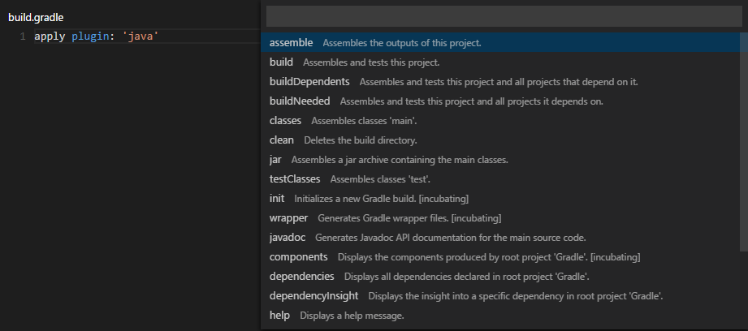

# VSCode-Gradle

This extension provides support to run gradle tasks. 

## Features

* List gradle tasks (either project or all tasks)
* Run gradle tasks and view output
* Load tasks when `build.gradle` file is found in root workspace
* Refresh tasks when `build.gradle` changes

## Credits

This project is a fork of [Cazzar/vscode-gradle](https://github.com/Cazzar/vscode-gradle), which is no longer maintained.

## License

See [LICENSE.md](./LICENSE.md).
