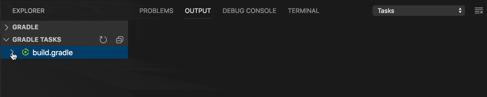
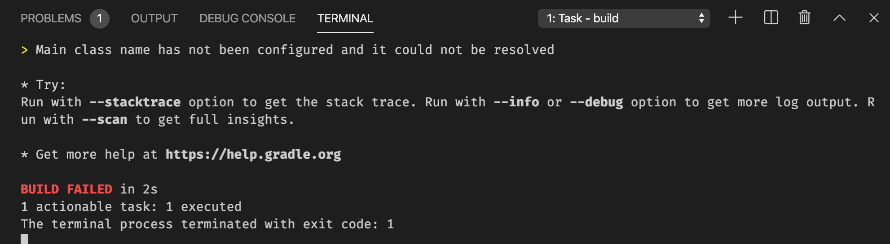

# VS Code Gradle Tasks

[](https://marketplace.visualstudio.com/items?itemName=richardwillis.vscode-gradle)
[](https://github.com/badsyntax/vscode-gradle/actions?query=workflow%3ABuild)
[](https://sonarcloud.io/dashboard?id=badsyntax_vscode-gradle)
[](https://marketplace.visualstudio.com/items?itemName=richardwillis.vscode-gradle)
[](https://github.com/badsyntax/vscode-gradle/issues?q=is%3Aissue+is%3Aopen+label%3Abug)

Run Gradle tasks in VS Code.



## Features

- Run [Gradle tasks](https://gradle.org/) as [VS Code tasks](https://code.visualstudio.com/docs/editor/tasks)
- List & run Gradle tasks in the Explorer
- [More Features »](./FEATURES.md)

## Requirements

- [Java >= 8](https://adoptopenjdk.net/) must be installed
- Local Gradle wrapper executables must exist at the root of the workspace folders (either `gradlew` or `gradlew.bat`, depending on your environment)

## Extension Settings

This extension contributes the following settings:

- `gradle.autoDetect`: Automatically detect Gradle tasks
- `gradle.enableTasksExplorer`: Enable an explorer view for Gradle tasks
- `gradle.taskPresentationOptions`: Task presentation options, see [tasks output behaviour](https://code.visualstudio.com/docs/editor/tasks#_output-behavior)
- `gradle.focusTaskInExplorer`: Focus the task in the explorer when running a task
- `gradle.debug`: Show extra debug info in the output panel

This extension supports the following settings:

- `java.home`: Absolute path to JDK home folder used to launch the gradle daemons. (Contributed by [vscode-java](https://github.com/redhat-developer/vscode-java).)

## Snippets

This extensions provides snippets for the groovy and kotlin build files:

- `cgt`: Create a new Gradle task

## Troubleshooting

<details><summary>View logs by selecting "Gradle Tasks" in the output panel</summary>


</details>

<details><summary>Task output will be shown in the Terminal panel</summary>



</details>

<details><summary>Set the "gradle.debug" setting to "true" to view debug logs in the output panel</summary>


</details>

<details><summary>"No connection to the gradle server. Try restarting the server"</summary>


This error means the gradle task server has stopped, or there was an error starting it. Click on "Restart Server" to restart it.

If you continue to get this error, view the task error messages by selecting "Gradle Tasks Server" in the Terminal panel.

The task server is started using a [shell script](https://gist.github.com/badsyntax/d71d38b1700325f31c19912ac3428042) generated by [CreateStartScripts](https://docs.gradle.org/current/dsl/org.gradle.jvm.application.tasks.CreateStartScripts.html). The script uses `#!/usr/bin/env sh` and is as portable as the gradle wrapper script. If there are any problems executing the start script then it's likely an issue either with your `$PATH`, or java was not installed.

### PATH problems

The following error demonstrates a typical issue with your `$PATH`:

```shell
env: sh: No such file or directory
The terminal process terminated with exit code: 127
```

Use the following task to debug your shell environment within vscode:

```json
{
  "version": "2.0.0",
  "tasks": [
    {
      "label": "Print task shell info",
      "type": "shell",
      "command": "echo \"Path: $PATH \nShell: $SHELL\"",
      "problemMatcher": []
    }
  ]
}
```

#### Fixing your `$PATH`

Check your dotfiles (eg `~/.bashrc`, `~/.bash_profile`, `~/.zshrc`) and fix any broken `PATH` exports, or override the `PATH` env var by setting `terminal.integrated.env` in your vscode settings, for example:

```json
"terminal.integrated.env.osx": {
  "PATH": "/put/your:/paths/here",
}
```

### Java path problems

You might see an error like:

```shell
ERROR: JAVA_HOME is not set and no 'java' command could be found in your PATH.
```

The start script [should find](https://gist.github.com/badsyntax/d71d38b1700325f31c19912ac3428042#file-gradle-tasks-server-sh-L85-L105) the path to Java in the usual locations. If you get this error it suggests an issues with your `$PATH` or you simply haven't installed Java. Run the gradle wrapper script (eg `./gradlew tasks`) to debug further.

</details>

<details><summary>Incompatibility with other extensions</summary>

This extension is incompatible with the following extensions:

- [spmeesseman.vscode-taskexplorer](https://marketplace.visualstudio.com/items?itemName=spmeesseman.vscode-taskexplorer)

The reason for the incompatibility is due to the extensions providing the same tasks types (`gradle`) with different task definitions.

</details>

## Contributing

Refer to [CONTRIBUTING.md](./CONTRIBUTING.md) for instructions on how to run the project.

- 👉 [Submit a bug report](https://github.com/badsyntax/vscode-gradle/issues/new?assignees=badsyntax&labels=bug&template=bug_report.md&title=)
- 👉 [Submit a feature request](https://github.com/badsyntax/vscode-gradle/issues/new?assignees=badsyntax&labels=enhancement&template=feature_request.md&title=)

## Support

For general support queries, use the [#gradle-tasks](https://vscode-dev-community.slack.com/archives/C011NUFTHLM) channel in the slack development community workspace. Sign up here: https://aka.ms/vscode-dev-community

## Credits

- Originally forked from [Cazzar/vscode-gradle](https://github.com/Cazzar/vscode-gradle)
- Inspired by the built-in [npm extension](https://github.com/microsoft/vscode/tree/master/extensions/npm)

## Release Notes

See [CHANGELOG.md](./CHANGELOG.md).

## License

See [LICENSE.md](./LICENSE.md).
