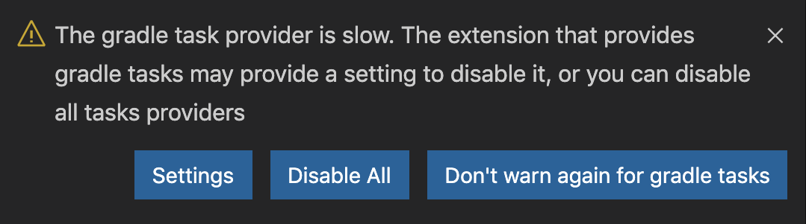

# vscode-gradle

[](https://github.com/badsyntax/vscode-gradle/actions?query=workflow%3ABuild)
[](https://marketplace.visualstudio.com/items?itemName=richardwillis.vscode-gradle)
[](https://marketplace.visualstudio.com/items?itemName=richardwillis.vscode-gradle)
[](https://sonarcloud.io/dashboard?id=badsyntax_vscode-gradle)
[](https://dependabot.com)

Run Gradle tasks in VS Code.


## Features

- Run [Gradle tasks](https://gradle.org/) as [VS Code tasks](https://code.visualstudio.com/docs/editor/tasks)
- List & run Gradle tasks in the Explorer
- Multi-root workspace folders supported
- Groovy/Kotlin build files supported
- Multi-project builds supported

> **Note:** Local Gradle wrapper executables must exist at the root of the workspace folders (either `./gradlew` or `.\gradlew.bat`, depending on your environment).

## Extension Settings

This extension contributes the following settings:

- `gradle.autoDetect`: Automatically detect Gradle tasks
- `gradle.enableTasksExplorer`: Enable an explorer view for Gradle tasks

## Snippets

This extensions provides snippets for the groovy and kotlin build files:

- `cgt`: Create a new Gradle task

## Slow Task Provider Warning

[Since vscode v1.40](https://code.visualstudio.com/updates/v1_40#_slow-task-provider-warning) you will see warning notifications when the Gradle task provider takes too long.



It can take a while to refresh the Gradle tasks, so you should permanently ignore this warning by clicking on "Don't warn again for Gradle tasks", or add the following to your `settings.json`:

```json
"task.slowProviderWarning": [
  "gradle"
]
```

## Troubleshooting

<details><summary>View the Gradle Tasks refresh process output and errors by selecting "Gradle Tasks" in the output panel.</summary>


</details>

<details><summary>Gradle Task output and errors will be shown in the Terminal panel after you've run a task.</summary>


</details>

## Credits

- Originally forked from [Cazzar/vscode-gradle](https://github.com/Cazzar/vscode-gradle)
- Heavily inspired by the built-in [npm extension](https://github.com/microsoft/vscode/tree/master/extensions/npm)

## Release Notes

See [CHANGELOG.md](./CHANGELOG.md).

## License

See [LICENSE.md](./LICENSE.md).
