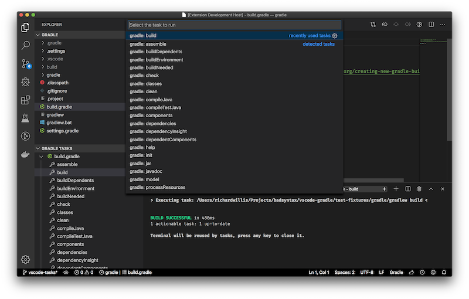

# vscode-gradle

<a href="https://marketplace.visualstudio.com/items?itemName=richardwillis.vscode-gradle"></a>

<!--  -->

This extension provides support to run gradle tasks.



## Settings

Use local `gradlew`:

```json
"gradle.useCommand": "./gradlew"
```

Use global `gradlew` (default):

```json
"gradle.useCommand": "gradlew"
```

Use project tasks:

```json
"gradle.tasks.args": ""
```

Use all tasks (default):

```json
"gradle.tasks.args": "--all"
```

Disable tasks explorer:

```json
"gradle.enableTasksExplorer": false
```

Enable tasks explorer (default):

```json
"gradle.enableTasksExplorer": false
```

## Features

- List gradle tasks in the Command Palette
- List gradle tasks in the Explorer
- Read project or all tasks (via custom gradle tasks arguments)
- Run gradle tasks (via Command Palette or Explorer) and view output
- Load tasks when `build.gradle` file is found in root workspace
- Refresh tasks when `build.gradle` changes
- Kill gradle task processes

## Credits

This project is a fork of [Cazzar/vscode-gradle](https://github.com/Cazzar/vscode-gradle), which is no longer maintained.

## TODO

See [TODO.md](./TODO.md).

## License

See [LICENSE.md](./LICENSE.md).
