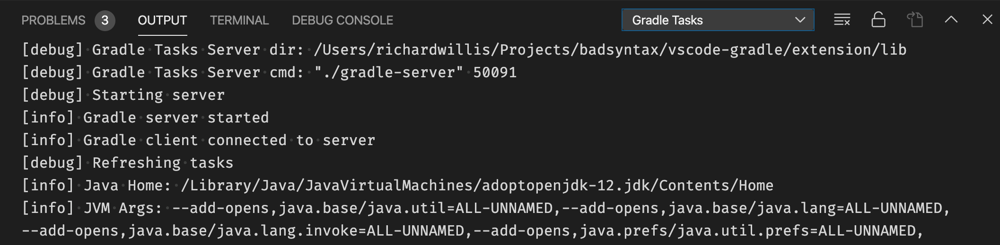

# VS Code Gradle Tasks

[](https://marketplace.visualstudio.com/items?itemName=richardwillis.vscode-gradle)
[](https://github.com/badsyntax/vscode-gradle/actions?query=workflow%3ABuild)
[](https://sonarcloud.io/dashboard?id=badsyntax_vscode-gradle)
[](https://marketplace.visualstudio.com/items?itemName=richardwillis.vscode-gradle)
[](https://github.com/badsyntax/vscode-gradle/issues?q=is%3Aissue+is%3Aopen+label%3Abug)

Run Gradle tasks in VS Code.


## Features

This extension provides a visual interface for your Gradle build. You can view Gradle projects and run Gradle tasks.

This extension supports whatever Gradle supports and is language/project agnostic, but it can work nicely alongside other extensions like the [Java language support extension](https://github.com/redhat-developer/vscode-java).

👉 [All Features](./FEATURES.md)

## Requirements

- [Java >= 8](https://adoptopenjdk.net/) must be installed
- Local Gradle wrapper executables must exist at the root of the workspace folders

## Settings

This extension contributes the following settings:

- `gradle.autoDetect`: Automatically detect Gradle tasks
- `gradle.enableTasksExplorer`: Enable an explorer view for Gradle tasks
- `gradle.taskPresentationOptions`: Task presentation options, see [tasks output behaviour](https://code.visualstudio.com/docs/editor/tasks#_output-behavior)
- `gradle.focusTaskInExplorer`: Focus the task in the explorer when running a task
- `gradle.javaDebug`: Debug JavaExec tasks (see below for usage)
- `gradle.debug`: Show extra debug info in the output panel
- `gradle.tasks.useImportJvmArgs`: Use the JVM args as set by `java.import.gradle.jvmArguments` when running tasks.

This extension supports the following settings, which are contributed by [vscode-java](https://github.com/redhat-developer/vscode-java):

TODO: GRADLE_HOME

- `java.home`: Absolute path to JDK home folder used to launch the gradle daemons
- `java.import.gradle.user.home`: Setting for `GRADLE_USER_HOME`
- `java.import.gradle.jvmArguments`: JVM arguments to pass to Gradle
- `java.import.gradle.wrapper.enabled`: Enable/disable the Gradle wrapper
- `java.import.gradle.version`: Gradle version, used if the gradle wrapper is missing or disabled

## Supported Environment Variables

Most of the standard Java & Gradle environment variables are supported:

- `JAVE_HOME` (overridden by `java.home`)
- `GRADLE_USER_HOME` (overridden by `java.import.gradle.user.home`)

### Setting Project Environment Variables

You can use an environment manager like [direnv](https://direnv.net/) to set project specific environment variables, or set the variables in the terminal settings within `.vscode/settings.json`, for example:

```json
{
  "terminal.integrated.env.osx": {
    "GRADLE_USER_HOME": "${workspaceFolder}/.gradle"
  }
}
```

Note, the VS Code settings take precedence over the environment variables.

## Debugging JavaExec Tasks


This extension provides an experimental feature to debug [JavaExec](https://docs.gradle.org/current/dsl/org.gradle.api.tasks.JavaExec.html) tasks. Before using this feature you need to install the [Debugger for Java](https://marketplace.visualstudio.com/items?itemName=vscjava.vscode-java-debug) and [Language Support for Java](https://marketplace.visualstudio.com/items?itemName=redhat.java) extensions.

To enable this feature you need to specify which tasks can be debugged within your project `.vscode/settings.json` file:

```json
"gradle.javaDebug": {
    "tasks": [
        "run",
        "test",
        "subproject:customJavaExecTask"
    ]
}
```

You should now see a `debug` command next to the `run` command in the Gradle Tasks view. The `debug` command will start the Gradle task with [jdwp](https://docs.oracle.com/en/java/javase/11/docs/specs/jpda/conninv.html#oracle-vm-invocation-options) `jvmArgs` and start the vscode Java debugger.

### Debugging Limitations

You'll need to remove any `jdwp` options that might have been set in your task configuration (eg via `jvmArgs`).

## Snippets

This extensions provides snippets for the groovy and kotlin build files:

- `cgt`: Create a new Gradle task

## Extension API

This extension exposes a `runTask` api with the following definition:

```ts
(
  projectFolder: string, // absolute path of root project folder
  taskName: string,
  args?: string[],
  onOutput?: (output: Output) => void
) => Promise<void>;
```

You can use this API to run Gradle tasks. It doesn't matter when you call this method as it will wait for tasks to be loaded before running the task.

## Troubleshooting

<details><summary>View logs by selecting "Gradle Tasks" in the output panel</summary>


</details>

<details><summary>Task output will be shown in the Terminal panel</summary>


</details>

<details><summary>Set the "gradle.debug" setting to "true" to view debug logs in the output panel</summary>



</details>

<details><summary>"No connection to the gradle server. Try restarting the server"</summary>


This error means the Gradle Task server has stopped, or there was an error starting it. Click on "Restart Server" to restart it.

If you continue to get this error, view the task error messages by selecting "Gradle Tasks Server" in the Terminal panel.

The task server is started using a [shell script](https://gist.github.com/badsyntax/d71d38b1700325f31c19912ac3428042) generated by [CreateStartScripts](https://docs.gradle.org/current/dsl/org.gradle.jvm.application.tasks.CreateStartScripts.html). The script uses `#!/usr/bin/env sh` and is as portable as the gradle wrapper script. If there are any problems executing the start script then it's likely an issue either with your `$PATH`, or java was not installed.

### PATH problems

The following error demonstrates a typical issue with your `$PATH`:

```shell
env: sh: No such file or directory
The terminal process terminated with exit code: 127
```

Use the following task to debug your shell environment within vscode:

```json
{
  "version": "2.0.0",
  "tasks": [
    {
      "label": "Print task shell info",
      "type": "shell",
      "command": "echo \"Path: $PATH \nShell: $SHELL\"",
      "problemMatcher": []
    }
  ]
}
```

#### Fixing your `$PATH`

Check your dotfiles (eg `~/.bashrc`, `~/.bash_profile`, `~/.zshrc`) and fix any broken `PATH` exports, or override the `PATH` env var by setting `terminal.integrated.env` in your vscode settings, for example:

```json
"terminal.integrated.env.osx": {
  "PATH": "/put/your:/paths/here",
}
```

### Java path problems

You might see an error like:

```shell
ERROR: JAVA_HOME is not set and no 'java' command could be found in your PATH.
```

The start script [should find](https://gist.github.com/badsyntax/d71d38b1700325f31c19912ac3428042#file-gradle-tasks-server-sh-L85-L105) the path to Java in the usual locations. If you get this error it suggests an issues with your `$PATH` or you simply haven't installed Java. Run the gradle wrapper script (eg `./gradlew tasks`) to debug further.

</details>

<details><summary>Incompatibility with other extensions</summary>

This extension is incompatible with the following extensions:

- [spmeesseman.vscode-taskexplorer](https://marketplace.visualstudio.com/items?itemName=spmeesseman.vscode-taskexplorer)

The reason for the incompatibility is due to the extensions providing the same tasks types (`gradle`) with different task definitions.

</details>

## Support

For general support queries, use the [#gradle-tasks](https://vscode-dev-community.slack.com/archives/C011NUFTHLM) channel in the [slack development community workspace](https://aka.ms/vscode-dev-community), or

- 👉 [Submit a bug report](https://github.com/badsyntax/vscode-gradle/issues/new?assignees=badsyntax&labels=bug&template=bug_report.md&title=)
- 👉 [Submit a feature request](https://github.com/badsyntax/vscode-gradle/issues/new?assignees=badsyntax&labels=enhancement&template=feature_request.md&title=)

## Contributing

Refer to [CONTRIBUTING.md](./CONTRIBUTING.md) for instructions on how to run the project.

- 👉 [Architecture Overview](./ARCHITECTURE.md)

## Credits

- Originally forked from [Cazzar/vscode-gradle](https://github.com/Cazzar/vscode-gradle)
- Inspired by the built-in [npm extension](https://github.com/microsoft/vscode/tree/master/extensions/npm)
- Thanks to all who have submitted bug reports and feedback 👍

## Release Notes

See [CHANGELOG.md](./CHANGELOG.md).

## License

See [LICENSE.md](./LICENSE.md).
