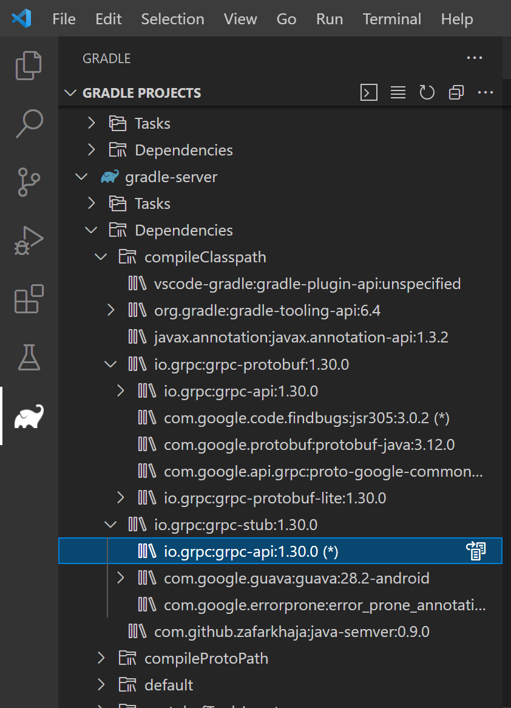
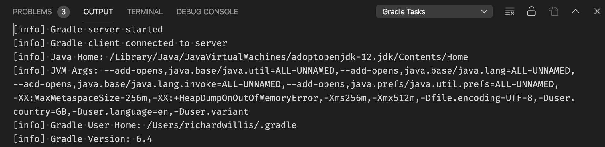

# Gradle for Java

[](https://marketplace.visualstudio.com/items?itemName=vscjava.vscode-gradle)
[](https://github.com/microsoft/vscode-gradle/actions/workflows/main.yml?query=workflow%3A%22%5C%22Build%22)
[](https://github.com/microsoft/vscode-gradle/issues?q=is%3Aissue+is%3Aopen+label%3Abug)

This VS Code extension provides a visual interface for your Gradle build. You can use this interface to view Gradle Tasks and Project dependencies, or run Gradle Tasks as VS Code Task. The extension also offers better Gradle file (e.g. `build.gradle`) authoring experience including syntax highlighting, error reporting and auto completion. The extension works nicely alongside other Java extensions in the [Extension Pack for Java](https://marketplace.visualstudio.com/items?itemName=vscjava.vscode-java-pack).

## Requirements

- [VS Code >= 1.76.0](https://code.visualstudio.com/download)
- [Java from 8 to 21](https://adoptium.net/)

## Project Discovery

This extension supports both root and nested Gradle projects. A Gradle project is identified by having Gradle Wrapper scripts (`gradlew` or `gradlew.bat`) or Gradle build files (`build.gradle` or `settings.gradle` and their Kotlin versions) at the root of a directory. (Nested Gradle project discovery is not enabled by default, set `"gradle.nestedProjects": true` to enable it.)

## Feature Overview

Once the extension is activated you will see a new Gradle icon in the [activity bar](https://code.visualstudio.com/docs/getstarted/userinterface). Clicking on this icon will reveal some tree views in the sidebar.

> Protip: you can move drag & drop any of these tree views into the main explorer view for easier access. This is especially useful for pinned tasks.

You can also run any Gradle task as a [VS Code task](https://code.visualstudio.com/docs/editor/tasks). Access the Gradle VS Code tasks by running `Run Task` from the command palette.

<details><summary>List projects and tasks</summary>

A Gradle build can have one or more projects. Projects are listed in a flat list with the root project listed first, and sub-projects listed alphabetically thereafter.

When you expand a project, tasks are listed in a tree, grouped by the task group. You can toggle the display of the tasks by clicking on the `Show Flat List`/`Show Tree` button in the tree view header.


</details>

<details><summary>List project dependencies</summary>

The project's dependencies are included in the `Dependencies` item under the project. The dependencies are grouped by Gradle configurations and you can expand each configuration to find the corresponding ones. For omitted dependency (marked with a `(*)`), you can use the inline button `Go to Omitted Dependency` to go to the previously listed dependency.


</details>

<details><summary>Run tasks</summary>

Tasks can be run via:

- `Gradle Projects` or `Recent Tasks` tree views
- `Run Task` command
- `Run a Gradle Build` command

A running task will be shown with an animated "spinner" icon in the tree views, along with `Cancel Task` & `Restart Task` buttons. The `Cancel Task` button will gracefully cancel the task. The `Restart Task` button will first cancel the task, then restart it.


A task will be run a vscode terminal where you can view the task output.

Send a SIGINT signal (ctrl/cmd + c) in the terminal to gracefully cancel it.


Tasks run via the `Run a Gradle Build` command are not reflected in any of the tree views. Use this command to specify your own Gradle build arguments, for example to run multiple tasks or to exclude tasks.


</details>

<details><summary>Control task terminal behaviour</summary>

----

Use one terminal for each task type (default):

```json
"gradle.reuseTerminals": "task"
```


----

Use one terminal for all tasks:


```json
"gradle.reuseTerminals": "all"
```


----

Don't re-use terminals for any tasks. A new terminal will be created for each task run:

```json
"gradle.reuseTerminals": "off"
```


</details>

<details><summary>Debug tasks</summary>

This extension provides an experimental feature to debug [JavaExec](https://docs.gradle.org/current/dsl/org.gradle.api.tasks.JavaExec.html) and [Test](https://docs.gradle.org/current/dsl/org.gradle.api.tasks.testing.Test.html) tasks. Before using this feature you need to install the [Debugger for Java](https://marketplace.visualstudio.com/items?itemName=vscjava.vscode-java-debug) and [Language Support for Java](https://marketplace.visualstudio.com/items?itemName=redhat.java) extensions.

You might need to specify whether you want to clean output cache before debugging, to ensure Gradle doesn't skip any tasks due to output caching (this is most useful when debugging tests).

> Output cache is cleaned by adding a `cleanTaskName` task (eg `cleanTest`) to the build.

You should now see a `debug` command next to the `run` command in the Gradle Projects view. The `debug` command will start the Gradle task with [jdwp](https://docs.oracle.com/en/java/javase/11/docs/specs/jpda/conninv.html#oracle-vm-invocation-options) `jvmArgs` and start the vscode Java debugger.


</details>
<details><summary>Pin tasks</summary>

As there could be many tasks in a Gradle project, it can be useful to pin commonly used tasks. Pinned tasks will be shown under their project item. Pin a task by accessing the task context menu (by right-clicking a task). You can also pin a task with specific arguments.


To unpin a task, access the task context menu and select `Unpin Task`, or unpin all pinned tasks by clicking on the `Unpin all Tasks` button in the overflow button of tree view header.


</details>
<details><summary>List recent tasks</summary>

Recently run Gradle tasks are listed in a separate tree view. This can be useful to see a history of tasks and to easily access the associated task terminals.

The number shown next to the task is the amount of times the task has been run. Click on the `Show Terminal` button next to a task to view the most recent terminal for that task. Click on the `Close Terminal/s` button to close the terminal/s for that task.

Click on the `Clear Recent Tasks` button in the tree view header to remove all recent tasks from the list, or click on the `Close All Terminals` button to close all task terminals.


</details>
<details><summary>List & kill Gradle daemons</summary>

Gradle daemon processes are listed by their process ID in a separate tree view and can have the following states: `IDLE`, `BUSY`, `STOPPED`, `STOPPING`, `CANCELED`.

Stop individual daemons by clicking on the `Stop Daemon` button next to the listed daemon.

Stop all daemons by clicking on the `Stop Daemons` button in the tree view header.


After stopping a daemon, it will remain in the `STOPPED` state for a while, but the underlying process won't exist. This is the default Gradle behaviour.

Most of the time there should be no reason to stop a daemon. View more info on the [Gradle Daemon](https://docs.gradle.org/current/userguide/gradle_daemon.html) from the Gradle website.

The extension uses the Gradle wrapper to list daemons, and is quite a slow process. If the daemon view is not useful for you, you can simply collapse the view, or disable it completely.

</details>
<details><summary>Syntax highlighting for Gradle files</summary>

When opening a Groovy Gradle file, the Gradle language server will start and provide language features for you.

Basically, we offer a basic groovy syntax highlighting in gradle files, as VS Code does by default. After language server started, it will analyze the Gradle file and provide semantic tokens information, providing more precise highlighting results.


</details>
<details><summary>Document outline for Gradle files</summary>

The Gradle language server will provide the document outline for the current Gradle file. This view will help you to navigate to any part of this Gradle file easily.


</details>
<details><summary>Error reporting for Gradle files</summary>

The Gradle language server will use Groovy compile engine to analyze the Gradle build file and report syntax errors if exist. It will also get script classpaths from Gradle Build so that it can report compilation errors. The [Gradle default imports](https://docs.gradle.org/current/userguide/writing_build_scripts.html#script-default-imports) are supported.


</details>
<details><summary>Auto completion for Gradle files</summary>

The Gradle language server supports basic auto completions for a Gradle file, including
- Basic Gradle closures (e.g. dependencies {})
- Gradle closures from plugins (e.g. java {})
- Available methods in Gradle closures (e.g. mavenCentral() in dependencies {})
- Available fields in Gradle closures (e.g. sourceCompatibility in java {})
- Available dependencies in Maven central when declaring a dependency in dependencies closure
- Basic auto completion for `settings.gradle` (e.g. include())


We will continue improving the auto completion feature to support more cases in writing Gradle files.

</details>
<details><summary>Full features list</summary>

- List Gradle Tasks & Projects
- Run [Gradle tasks](https://gradle.org/) as [VS Code tasks](https://code.visualstudio.com/docs/editor/tasks)
- View [Gradle Dependencies](https://docs.gradle.org/current/userguide/declaring_dependencies.html)
- Supports massive Gradle projects (eg with 10000+ tasks)
- Uses the [Gradle Tooling API](https://docs.gradle.org/current/userguide/third_party_integration.html#embedding) to discover and run Gradle tasks
- Uses a long running gRPC server which provides good performance
- Supports Kotlin & Groovy build files
- Supports [multi-project builds](https://docs.gradle.org/current/userguide/multi_project_builds.html)
- Supports [multi-root workspaces](https://code.visualstudio.com/docs/editor/multi-root-workspaces)
- Supports nested projects (enabled via setting)
- Show flat or nested tasks in the explorer
- Gracefully cancel a running task
- Debug tasks
- Run/debug a task with arguments (supports both build & task args, eg `gradle tasks --all --info`)
- Pin tasks
- List recent tasks
- List & stop daemons
- Reports Gradle dist download progress
- Supports syntax highlighting for Groovy Gradle files
- Supports document outline for Groovy Gradle files
- Supports error reporting for Groovy Gradle files
- Supports auto completion for Groovy Gradle files

</details>

## Extension Settings

This extension contributes the following settings:

- `gradle.autoDetect`: Automatically detect Gradle tasks ("on" or "off")
- `gradle.focusTaskInExplorer`: Focus the task in the explorer when running a task (boolean)
- `gradle.nestedProjects`: Process nested projects (boolean or an array of directories)
- `gradle.reuseTerminals`: Reuse task terminals ("task" [default], "all", or "off")
- `gradle.javaDebug.cleanOutput`: Clean the task output cache before debugging (boolean)
- `gradle.debug`: Show extra debug info in the output panel (boolean)
- `gradle.disableConfirmations`: Disable the warning confirm messages when performing batch actions (eg clear tasks, stop daemons etc) (boolean)
- `gradle.allowParallelRun`: Allow to run tasks in parallel, each running will create a new terminal. This configuration will override `gradle.reuseTerminals` and always create new task terminals when running or debugging a task.
- `gradle.projectOpenBehaviour`: Specify the default method of opening newly created project ("Interactive", "Open" or "Add to Workspace")
- `java.gradle.buildServer.enabled`: Whether to use build server to synchronize Gradle project ("on" or "off")
- `java.gradle.buildServer.openBuildOutput`: Controls when the build output should open ("neverOpen", "openOnBuildStart" or "openOnBuildFailure")

## Gradle & Java Settings

Set Gradle & Java options with standard environment variables or standard Gradle settings (eg via `gradle.properties` or task configuration).

### Example Environment Variables

- `JAVA_HOME`
- `GRADLE_USER_HOME`

_Note, the VS Code settings take precedence over the environment variables._

Use an environment manager like [direnv](https://direnv.net/) to set project specific environment variables

</details>

## Compatibility with the [Java language support](https://github.com/redhat-developer/vscode-java) extension

### Java-Specific Settings

This extension supports the following settings which are contributed by the [Java language support](https://github.com/redhat-developer/vscode-java) extension:

- `java.home`: (**deprecated** Please use `java.jdt.ls.java.home` as given below) Absolute path to JDK home folder used to launch the Gradle daemons
- `java.jdt.ls.java.home`: Absolute path to JDK home folder as per the latest VS code, used to launch the Gradle daemons
- `java.import.gradle.java.home`: Absolute path to JDK home folder used to launch the Gradle daemons (if set, this value takes precedence over `java.home`)
- `java.import.gradle.user.home`: Setting for `GRADLE_USER_HOME`
- `java.import.gradle.jvmArguments`: JVM arguments to pass to Gradle

  >Note: There should be a `space` between two arguments

- `java.import.gradle.wrapper.enabled`: Enable/disable the Gradle wrapper
- `java.import.gradle.version`: Gradle version, used if the Gradle wrapper is missing or disabled
- `java.import.gradle.home`: Use Gradle from the specified local installation directory or GRADLE_HOME if the Gradle wrapper is missing or disabled and no 'java.import.gradle.version' is specified.

### Class References

There are cases where Gradle tasks will generate Java classes. To ensure these Java classes are indexed correctly by the Java language server, you need to ensure the paths are added to the `.classpath`, and this is typically achieved using Gradle [`sourceSets`](https://docs.gradle.org/current/dsl/org.gradle.api.tasks.SourceSet.html).

Once you've configured your `sourceSets` correctly, follow these steps:

1. Generate your classes by running the relevant Gradle Task
2. Force the Language Server to index the generated classes by right-clicking on `build.gradle` and selecting `Update project configuration`.

At this point the Gradle `sourceSet` paths will be added to the `.classpath` and the Language Server will automatically update references when those classes change.

## Extension API

This extension provides an API which can be used by 3rd-party vscode extensions.

👉 [Extension API](./API.md)

## Troubleshooting

<details><summary>View logs by selecting "Gradle Tasks" in the output panel</summary>



</details>

<details><summary>Set the "gradle.debug" setting to "true" to view debug logs in the output panel</summary>


</details>

<details><summary>Task output will be shown in the Terminal panel</summary>


</details>

<details><summary>Task output is truncated</summary>

The integrated terminal has a limited buffer size and will not show the full output for tasks that generate a large output. Increase the terminal buffer size in your settings, for example:

```json
{
  "terminal.integrated.scrollback": 5000
}
```

</details>

<details><summary>"No connection to the gradle server. Try restarting the server"</summary>


This error means the Gradle Task server has stopped, or there was an error starting it. Click on "Restart Server" to restart it.

If you continue to get this error, view the task error messages by selecting "Gradle Tasks" in the output panel.

The task server is started using a [shell script](https://gist.github.com/badsyntax/d71d38b1700325f31c19912ac3428042) generated by [CreateStartScripts](https://docs.gradle.org/current/dsl/org.gradle.jvm.application.tasks.CreateStartScripts.html). The script uses `#!/usr/bin/env sh` and is as portable as the Gradle wrapper script. If there are any problems executing the start script then it's likely an issue either with your `PATH`, or Java is not installed.

### PATH problems

The following error demonstrates a typical issue with your `PATH`:

```shell
env: sh: No such file or directory
The terminal process terminated with exit code: 127
```

Use the following task to debug your shell environment within vscode:

```json
{
  "version": "2.0.0",
  "tasks": [
    {
      "label": "Print task shell info",
      "type": "shell",
      "command": "echo \"Path: $PATH \nShell: $SHELL\"",
      "problemMatcher": []
    }
  ]
}
```

#### Fixing your `$PATH`

Check your dotfiles (eg `~/.bash_profile`, `~/.bashrc`, `~/.zshrc`) and fix any broken `PATH` exports. See `Issues with environment vars` below for more information.

### Java path problems

You might see an error like:

```shell
ERROR: JAVA_HOME is not set and no 'java' command could be found in your PATH.
```

The start script [should find](https://gist.github.com/badsyntax/d71d38b1700325f31c19912ac3428042#file-gradle-tasks-server-sh-L85-L105) the path to Java in the usual locations. If you get this error it suggests an issues with your `$PATH` or you simply haven't installed Java. Run the Gradle wrapper script (eg `./gradlew tasks`) to debug further, or see `Issues with environment vars` below for more information.

### Shell environment

Another potential problem is that the `PATH` or `JAVA_HOME` environment vars have been defined within `.bashrc`. See `Issues with environment vars` below for more information.

</details>

<details><summary>Issues with environment vars</summary>

_(The following is only relevant for MacOS & Linux.)_

The Gradle Server is launched inside a non-interactive non-login shell, which loads the profile script (not the rc script). This means the shell will not load, for example, `~/.bashrc`. If you've defined `PATH` or other environment variables within `~/.bashrc`, they will not be available for the server startup script and not be available to Gradle.

Generally, environment settings should be defined in in `~/.bash_profile`, but as a workaround, you can load `~/.bashrc` from within `~/.bash_profile`for example:

```sh
if [ -r ~/.bashrc ]; then
  source ~/.bashrc
fi
```

</details>

<details><summary>"Orphaned" Java processes after quitting VS Code</summary>

You might notice some Java processes are not closed after existing VS Code. These processes are the Gradle Daemons that Gradle spawns. This is the default behaviour of Gradle.

You'll have `N` processes per Gradle version. Eventually Gradle will shut them down. Read more about the [Gradle Daemon](https://docs.gradle.org/current/userguide/gradle_daemon.html).

</details>

<details><summary>Incompatibility with other extensions</summary>

This extension is incompatible with the following extensions:

- [spmeesseman.vscode-taskexplorer](https://marketplace.visualstudio.com/items?itemName=spmeesseman.vscode-taskexplorer)

The reason for the incompatibility is due to the extensions providing the same tasks types (`gradle`) with different task definitions.

</details>

## Support

- 👉 [Submit a bug report](https://github.com/microsoft/vscode-gradle/issues/new?assignees=&labels=bug&template=bug_report.md&title=)
- 👉 [Submit a feature request](https://github.com/microsoft/vscode-gradle/issues/new?assignees=&labels=enhancement&template=feature_request.md&title=)
- 👉 [Submit any feedback](https://github.com/microsoft/vscode-gradle/issues/new/choose)

## Data/Telemetry

VS Code collects usage data and sends it to Microsoft to help improve our products and services. Read our [privacy statement](http://go.microsoft.com/fwlink/?LinkId=521839) to learn more. If you don’t wish to send usage data to Microsoft, you can set the `telemetry.enableTelemetry` setting to `false`. Learn more in our [FAQ](https://code.visualstudio.com/docs/supporting/faq#_how-to-disable-telemetry-reporting).

## Contributing

Refer to [CONTRIBUTING.md](./CONTRIBUTING.md) for instructions on how to run the project.

👉 [Architecture Overview](./ARCHITECTURE.md)

## Credits

This project was originally started by [@badsyntax](https://github.com/badsyntax) and is now currently maintained by Microsoft. Huge thanks to [@badsyntax](https://github.com/badsyntax) who started it all and made this Gradle extension available.

- Originally forked from [Cazzar/vscode-gradle](https://github.com/Cazzar/vscode-gradle)
- Inspired by the built-in [npm extension](https://github.com/microsoft/vscode/tree/main/extensions/npm)
- Thanks to [@hanct](https://github.com/hanct) for providing feature suggestions and BETA testing
- Thanks to [@dcermak](https://github.com/dcermak) for providing inspiration to write some unit tests
- Thanks to all who have submitted bug reports and feedback

## Related Extensions

Check out [vscode-spotless-gradle](https://marketplace.visualstudio.com/items?itemName=richardwillis.vscode-spotless-gradle) which formats your source files using [Spotless](https://github.com/diffplug/spotless) & Gradle.

## Release Notes

See [CHANGELOG.md](./CHANGELOG.md).

## License

See [LICENSE.md](./LICENSE.md).
